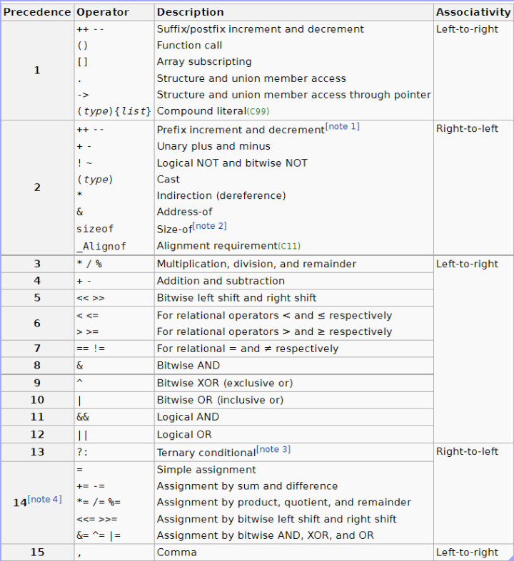
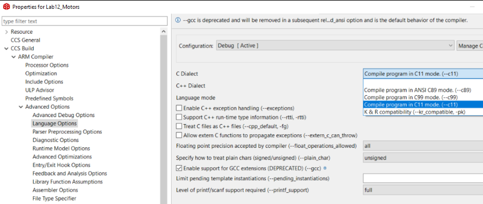

# 💻 C Programming

(faq-c_programming)=
## C Programming Language

### _What is the operator precedence in C?_
 
What is the value of Y if you have Y = X & 0xE0 >> 2 ?  Are you expecting the operation will be bit masking followed by shifting, (P4->IN & 0xE0) >>2?   In C/C++, << and >> take precedence over & (bitwise AND). So, X & 0xE0 >> 2 is the same as P4->IN & (0xE0 >> 2) or P4->IN & 0x03. You all know that 2 + 2 x 2 = 6 not 8, right?  If you are not sure about the precedence order, use parentheses. I don't remember the entire precedence order, such as https://en.cppreference.com/w/c/language/operator_precedence.  So, I just use parentheses - it is good coding practice. Otherwise, you will end up wasting hours or days debugging your code.

Here is a quiz:

One of these is correct.  One is incorrect. Or are they both the same?
```C
while( (SysTick->CTRL & 0x00010000) == 0 );
```
or
```C
while( SysTick->CTRL & 0x00010000 == 0 );   
``` 

You can find the precedence order in the textbook on page 111 or below:


 
**_Are there different versions of C?_**

Yes, there are different revisions (dialects) of the C programming language standard, such as C79, C89, C99, C11, & C17; 
https://en.wikipedia.org/wiki/C_(programming_language)#History
 
The latest standard is C17, but the most popular versions are perhaps C89 (ANSI C) and C79 (K&R C).     
CCS supports K&R, C89, C99, and C11.
If you want to change it, go to project properties, CCS Build > Advanced Options > Language Options, and select the dialect you wish to use, as shown below.



The default dialect in CCS is C89, but C11 is used in ECE382 to support the for-loop variable declaration such as for (int i = 0; ... ).


### _What is the switch statement, and how does it work?_

The switch statement is a multi-way decision that tests whether an expression matches one of several constant integer values and branches accordingly.

```C
switch (expression) {
    case const-expr:  
        statements
        break;
    case const-expr:  
        statements
        break;
    default:
        statements
        break;
}
``` 

If you don't add `break`, the program will flow through the following case statements.  Here is an example

```C
int nwhite, nother, ndigit[10]; 

while ((ch == getchar()) != EOF) {
    switch (ch) {
        case '0':   case '1':  case '2' :  case '3': case '4' :       
        case '5':   case '6':  case '7' :  case '8': case '9' :   
        // if ch is between '0' and '9'
            ndigit[ch-'0']++;
            break;
        case ' ': 
        case '\n':
        case '\t':   
        // if ch is a space, \n, or \t
            nwhite++;
            break;
        default:
            nother++;
            break;
    }
}
``` 
Reference: B. Kernighan & D. Ritchie, "The C Programming Language," 2nd ed, pp. 58, 1988, Pearson Education.**

### _What is the _static_ qualifier?_

The functions inside C files are by default *global* functions.  Although they are not declared in the associated .h files, the functions can be seen (and even called - I don't want to show you how because it is not good practice) by other files. So, you will have a compile error if you have two functions with the same name in two C files.  
 
Then, how can you make the function invisible to other files?  Use the *static* qualifier.  It makes your functions private in the C file they are defined. 
 
Variables declared outside functions are also global variables, and other files can see them.  They can also be static to make them private (again invisible by other files) - this is different from the static variables inside a function. 


